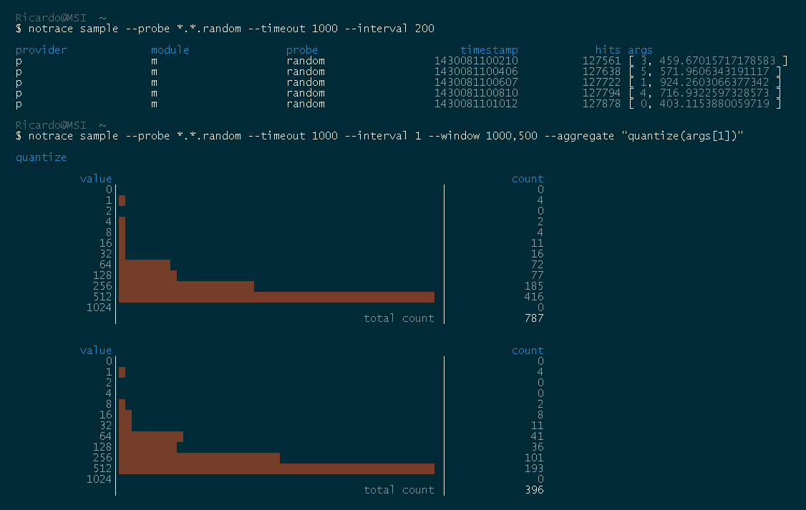

## API documentation

http://rstuven.github.com/node-notrace/

## CLI

### Install

    npm install notrace --global

### Usage

    notrace list --help
    notrace sample --help

### Example

    node examples/provider.js &

    notrace sample --probe *.*.random --timeout 1000 --interval 200

    notrace sample --probe *.*.random --timeout 1000 --interval 1 --window 1000,500 --aggregate "quantize(args[1])"

